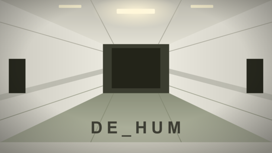

# de_Hum

**English** · [Русский](README.ru.md)

A map for **Counter-Strike 2**, made in Source 2 / Hammer.

> Fan-made. Not affiliated with or endorsed by Valve. Counter-Strike 2, Source 2, Hammer and Steam are trademarks of Valve Corporation.

- **Mode:** competitive bomb defusal (`de_`).
- **Setting:** the **Backrooms**, white variant: an endless maze of identical white rooms under humming fluorescent lights.
- **Size:** compact, about 3000×3000 units.
- **On the map:** two bomb sites, T and CT spawns, buy zones, a radar made with RadGen, a navigation mesh for bots.

**Status: playable, published in the Steam Workshop.** Small polish and optional detailing are left, see below.

## What is in the repository

- **`de_zarya-design.md`** - the full design document (in Russian): the theme, the layout, the principles, what is done, open tasks and the pitfalls already hit (compiling, spawns, lighting, nav mesh, bots). The file name is historical: the map used to be called de_Zarya.
- **`de_mygame/`** - the CS2 addon content, a copy of `content/csgo_addons/de_mygame/`:
  - `maps/` - the map `de_hum.vmap` and the radar project `de_hum.radgen`;
  - `materials/`, `postprocess/`, `panorama/` (the map radar);
  - `soundevents/` - the map's sound events; for the sounds themselves see below.
- **`image-1784219049433.png`** - the project icon.
- **`tools/publish_github.sh`** - builds the public copy for GitHub.

## Not included in the public version

The working copy lives on a home Gitea server. Third-party files whose licence we cannot confirm do not go to GitHub. They are removed from the whole published history, not just from the latest commit:

- **`de_mygame/sounds/`** - the sounds (birds, ventilation, room hum) **came from Steam Workshop items**; their authors and licences are unknown to us. `soundevents_addon.vsndevts` refers to them by name: `sounds/bird_01.vsnd` … `bird_06.vsnd`, `sounds/interior_01.vsnd` (room hum), `sounds/vent_01.vsnd` (ventilation). Put your own `.wav` files with these names into `de_mygame/sounds/` and Hammer compiles them.
- **`de_mygame/RadGen/RadGen3.sbsar`** and **`de_mygame/materials/radgen/`** - files of the third-party RadGen radar generator. Get RadGen from its author and install it as described there.
- **`de_mygame/maps/content_examples/`** - a Valve sample from the Workshop Tools; everyone who installs the tools has it.

## Build and run

- The addon in the Workshop Tools is called `de_mygame`; the map file name was kept.
- Hammer: Workshop Tools → Launch Tools → Asset Browser → the Hammer icon.
- Compile: `F9` → Build Map → **Fast Compile** (no lighting, quick) or **Full Compile** (lighting and cubemaps).
- To test with bots, start normal CS2, not `-tools` mode. Console: `map_workshop de_mygame de_hum`.

## Main pitfalls (details in the design document)

- T and CT spawns must be at least 16 units above the floor, otherwise the engine marks them invalid.
- An `info_player_start` is needed in addition to the T and CT spawns.
- The map box must be fully sealed, otherwise the compile reports a `leak`.
- If the nav mesh fails with "no walkable seeds", add a `point_nav_walkable` entity.
- Bot skill is set by `custom_bot_difficulty 0–3`; `bot_difficulty` does not affect it.
- Black hands and weapons are fixed with an `env_combined_light_probe_volume`.
- The Workshop radar can differ from the local one if the map is published before `Save Radar Image` in RadGen.

## Open tasks

- Stretch the buy zone over the whole spawn room: the log says "bot spawned outside of a buy zone".
- Flickering lights through I/O logic.
- Backrooms-style detailing: carpet, own props from Blender.

## Licence

Our own files (the map, materials, radar, documents, icon, script) are MIT, see [LICENSE](LICENSE). The sounds and the RadGen files are not part of the public version and are not covered by this licence.
